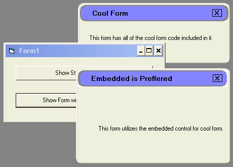



## Okie\-Cool \(Trekkie\) Form

### Description

Makes a "Trekkie" looking form by simply dropping the control on the form. Very light-weight, not a ton of features, but a very nice effect. There are two versions, one is a form that has all the code written into it, the other is a form utilizing the cool form control as an example of how much cleaner a project is when things like this are compartmentalized.
 
### More Info
 

             |
---                |---
**Submitted On**   |2005-09-30 09:34:56
**By**             |[Mike Douglas](https://github.com/Planet-Source-Code/PSCIndex/blob/master/ByAuthor/mike-douglas.md)
**Level**          |Intermediate
**User Rating**    |4.7 (14 globes from 3 users)
**Compatibility**  |VB 6\.0
**Category**       |[Custom Controls/ Forms/  Menus](https://github.com/Planet-Source-Code/PSCIndex/blob/master/ByCategory/custom-controls-forms-menus__1-4.md)
**World**          |[Visual Basic](https://github.com/Planet-Source-Code/PSCIndex/blob/master/ByWorld/visual-basic.md)
**Archive File**   |[Okie\-Cool\_1936471012005\.zip](https://github.com/Planet-Source-Code/mike-douglas-okie-cool-trekkie-form__1-62731/archive/master.zip)

